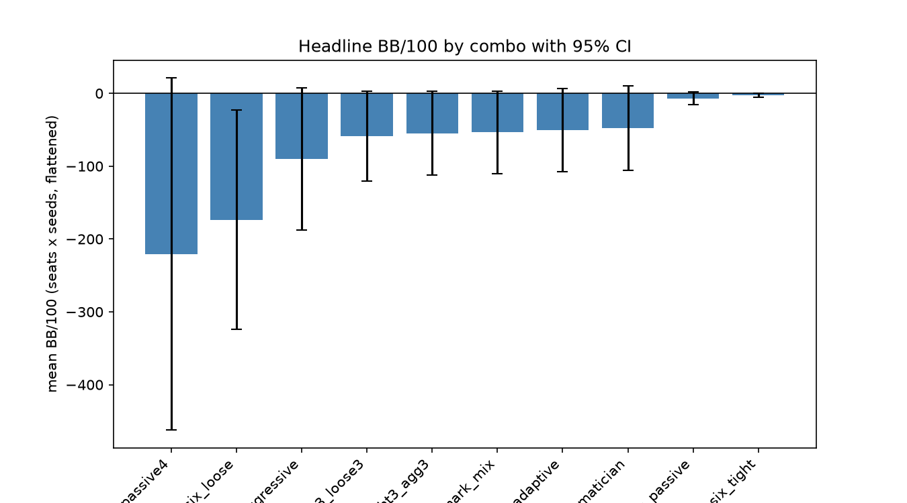
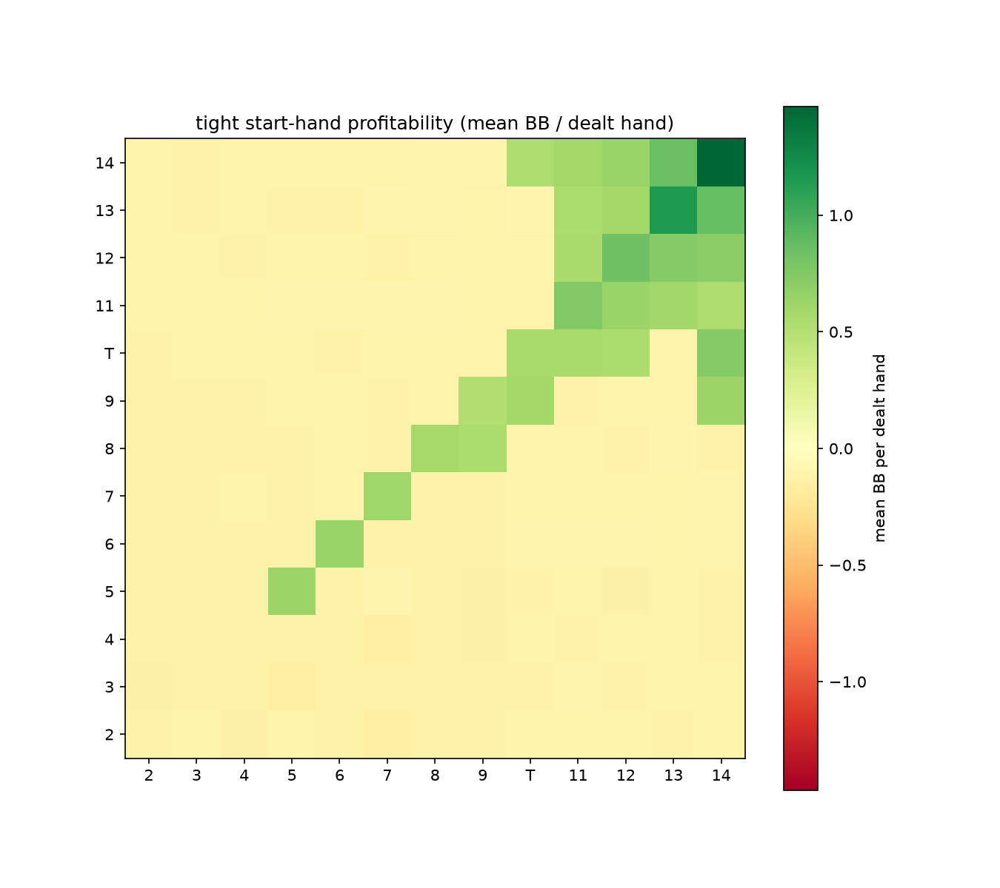
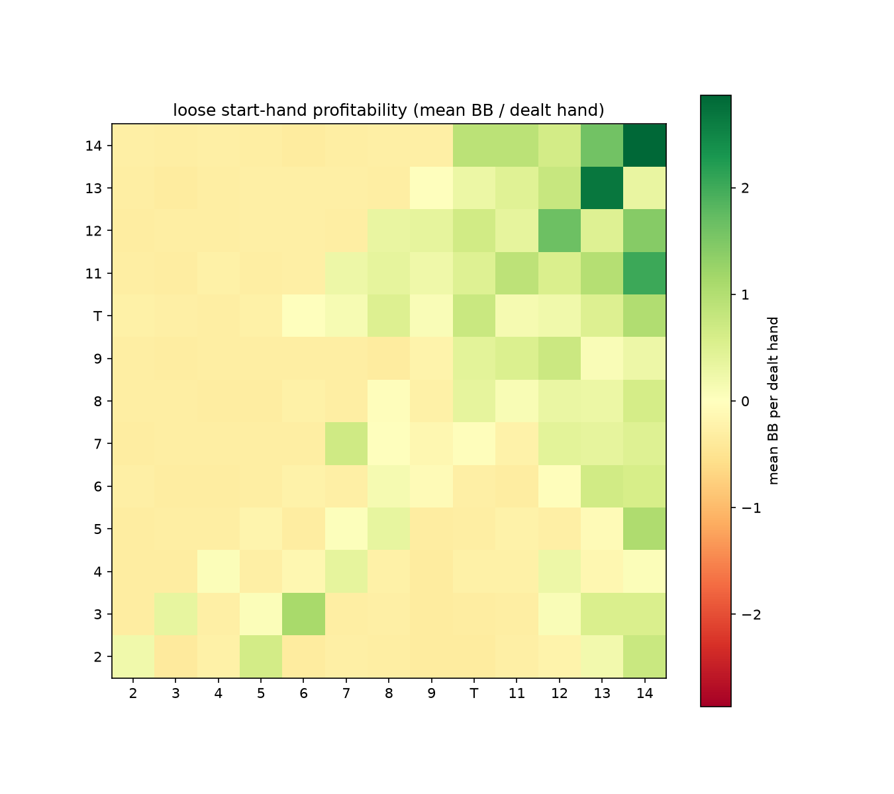
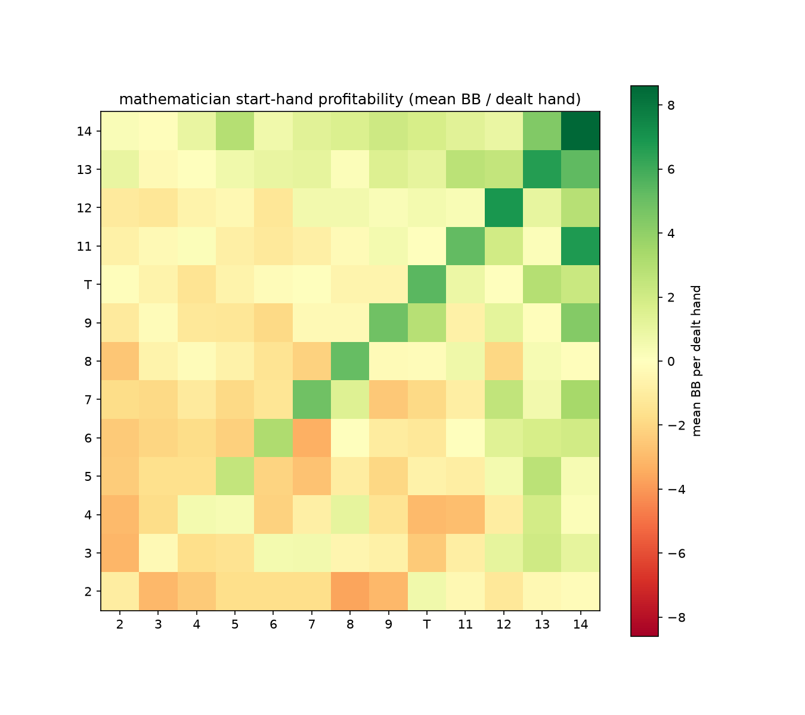
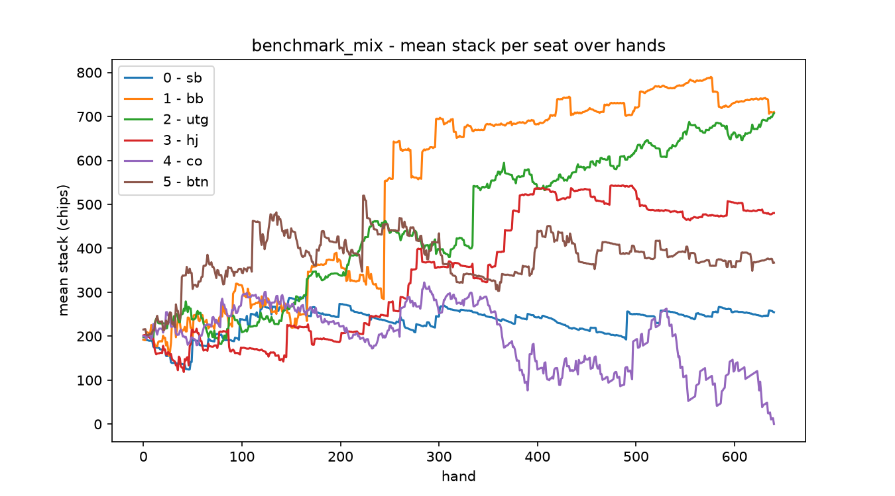
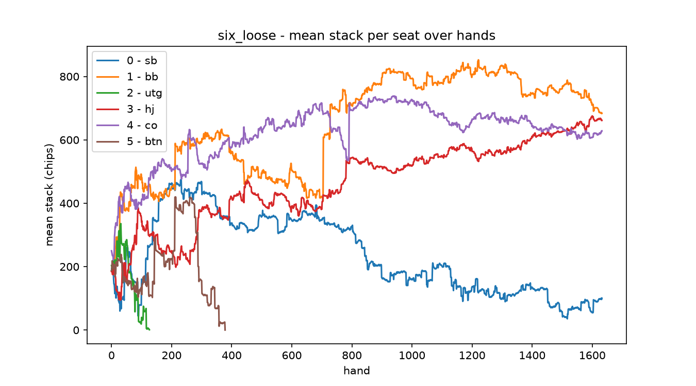
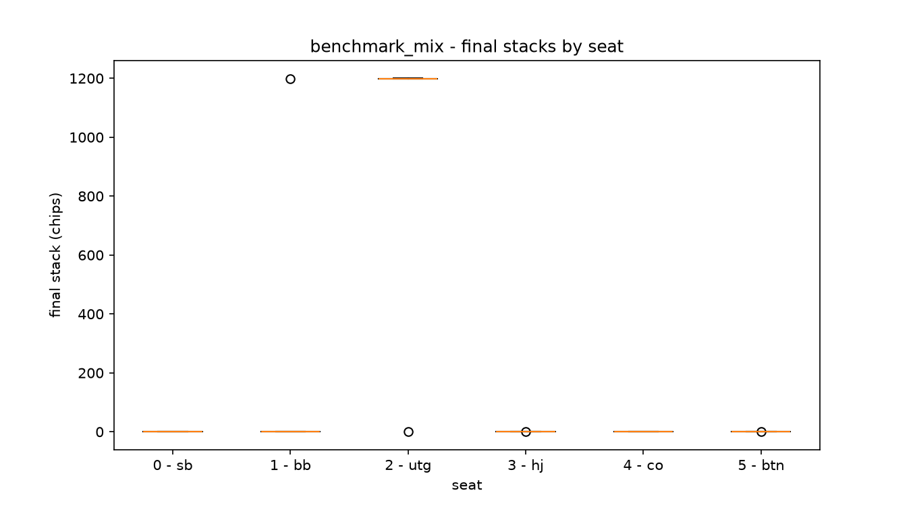
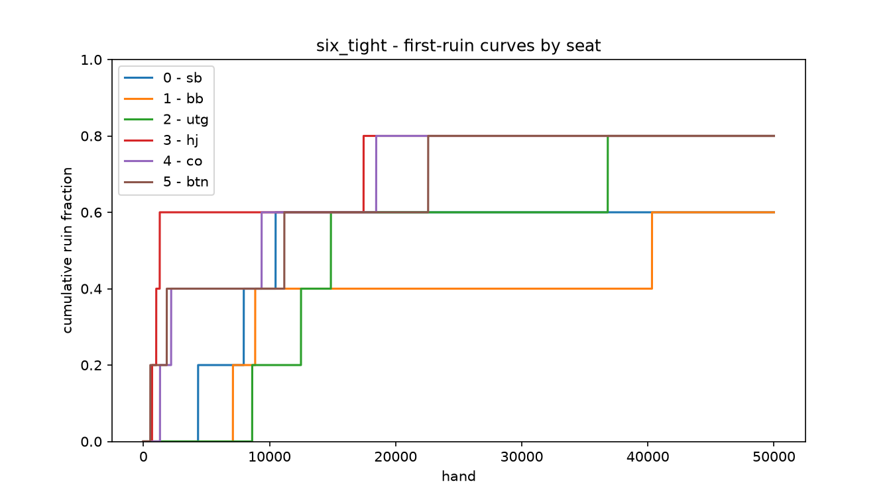
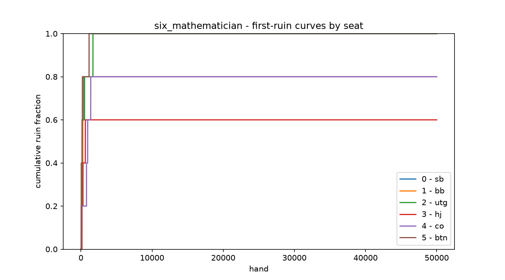

# Texas Hold'em Simulator for Strategy Analysis (No Bluff)

A deterministic simulation engine that answers one question: *which fixed poker style is most profitable over the long run, and how does mixing styles change that answer?* It pits six rule-driven no-bluff strategies (Tight, Loose, Aggressive, Passive, Mathematician, Adaptive) against each other under defined 6-max pot-limit rules and reports per-style win rates, BB/100, and first-passage ruin statistics.

[](https://www.python.org/)
[](https://numpy.org/)
[](https://numba.pydata.org/)
[](https://pandas.pydata.org/)
[](https://matplotlib.org/)
[](https://seaborn.pydata.org/)
[](https://docs.pytest.org/)



## Table of Contents

- [Introduction](#introduction)
- [Tech Stack](#tech-stack)
- [Project Structure](#project-structure)
- [The Model](#the-model)
- [Metrics](#metrics)
- [Quick Start](#quick-start)
- [Results](#results)
- [Testing](#testing)
- [Reproducibility](#reproducibility)
- [Limitations](#limitations)
- [Roadmap](#roadmap)

## Introduction

This simulator is a quantitative comparison of six rule-defined, **no-bluff** poker styles, following the experiment plan in the stage specifications (`docs/specs/`). Each style is a pure function of *hand, board, equity, pot odds, position, and action history* — there is no learning and no deception, so the results isolate the structural profitability of a style rather than its table-craft.

Every session is fully deterministic: a fixed seed drives the deck, the button, and the per-decision equity Monte Carlo, so a session replay produces **byte-identical** raw hand logs. That determinism lets the shipped reports be re-derived exactly from the committed `output/reports/` artifacts, and lets any single number be recomputed, not retrusted.

The central finding, under these no-rake, no-rebuy, self-terminating-table rules, is stark and honest: **the style that risks the least — Tight — loses the least and outlives every other table; every looser or EV-driven style busts its own table's statistical power, so "most profitable" is confounded with "outlives the horizon."** Full analysis in `docs/results.md`.

## Tech Stack

| Category          | Technologies |
|-------------------|--------------|
| Languages         | Python 3.12 |
| Numerics          | NumPy 1.26, Numba 0.67 (JIT hot paths) |
| Data processing   | Pandas 2.0 |
| Visualization     | Matplotlib 3.8, Seaborn 0.13 |
| Testing           | pytest 8.0 |

## Project Structure

```
poker/
├── card.py            # Card, Deck
├── hand_evaluator.py  # 7-card / 5-card evaluation (reference + numba-fast)
├── equity.py          # Preflop table + Monte Carlo equity (400 iters)
├── player.py          # Six strategy bots + base class
├── game.py            # Hand, betting rounds, side pots, all-in escape
├── simulator.py       # run_session, compute_session_stats (metrics)
├── experiments.py     # run_campaign / run_combo_seeds / manifest I/O
├── analysis.py        # summary CSVs + all five plot families
├── config.py          # frozen Config (single source of rule truth + digest)
├── actions.py, recorder.py, rng.py, jit.py
tests/                 # 38 test modules
data/preflop_equity.npy  # precomputed preflop equity table
output/reports/        # committed campaign summaries + plots
output/logs/           # raw session logs (gitignored; manifest is committed)
```

## The Model

- **6-max pot-limit.** Bets are capped by the pot (a raise may not exceed the current pot), which also caps a betting round once the raise ceiling is exhausted; an **all-in** remains available as the escape hatch. A round allows at most `max_aggressions = 4` (bet + 3 raises).
- **First-passage ruin.** A seat whose stack drops below the big blind is frozen (no longer dealt); it is counted ruined as of that hand. Play continues with the surviving seats until **fewer than 2 seats remain**, at which point the session ends early (the table died).
- **No rake, no rebuys.** Chips never leave the table except through losses, and a busted seat never returns. This is the single most important modeling decision: it guarantees tables self-destruct and limits how much data the looser/more-speculative styles can produce.
- **No bluffing.** Strategies act only on measurable equity and pot odds. *Documented semi-bluffs* are the only aggression without a made/strong hand: the Aggressive style continuation-bets as prior aggressor, Adaptive steals from folding tables, and Mathematician makes EV-positive pushes (raises only when equity clears pot odds by a margin and the raise is EV-justified). These are exclusions, not bluffs — the pot-limit rules already forbid the aggressive over-bet bluff that the cap prevents.
- **Fixed 6 seats**, one style per seat; initial stack 400 chips = 200 big blinds; blinds 1/2; the button rotates every hand.
- **Equity: Monte Carlo at 400 iterations** on a Numba fast path (preflop uses a precomputed table; postflop simulates runouts).

## Metrics

All session metrics are computed by one implementation, `compute_session_stats`, from the persisted raw hand log. The BB/100 denominator is the number of hands a seat was *live* for (before its first-passage ruin), so a seat that busts early is not diluted by dead hands; seats with zero live hands report `None`, never `0.0`.

```
BB/100    = (net / big_blind) / live_hands * 100
winrate   = won_hands / live_hands
ruin_hand = first hand on which the seat's stack fell below the big blind
positional EV zones: button = late; +1/+2 = blinds; +3/+4 = early; rest = middle
95% CI    = 2 * sigma / sqrt(seeds)     (seeds = number of independent sessions)
```

## Quick Start

Create a virtual environment, install, and confirm the test suite:

```bash
python3.12 -m venv .venv
.venv/bin/pip install -r requirements.txt -r requirements-dev.txt
.venv/bin/pytest -m "not slow"
```

> [!NOTE]
> The default `pytest.ini` already applies `-m "not slow"`, so `pytest` alone is enough after installing `requirements.txt`.

### Option A: full campaign (production run, reproducibility baseline)

Runs all 10 combinations x 5 seeds x 50,000 hands (50 sessions total) and writes the campaign manifest. On hardware comparable to the machine that produced the committed reports this takes roughly 2–4 minutes wall clock with 12 workers:

```bash
.venv/bin/python -c "from poker.experiments import run_campaign; run_campaign(num_hands=50_000, workers=12)"
```

### Option B: small smoke run (30–60 seconds)

One combination, one short session — enough to exercise the full engine, the manifest, and the digest check without the campaign cost:

```bash
.venv/bin/python -c "from poker.experiments import run_combo_seeds; run_combo_seeds('benchmark_mix', seeds=(101,), num_hands=2_000)"
```

The stage-05 gate uses the same single-session path at `num_hands=25` with seed `101` per seat to assert byte-level cross-worker determinism.

### Regenerate the reports from a manifest

Either campaign run above (or the committed `output/logs/campaign_manifest.json`) flows into the full reporting pipeline:

```bash
.venv/bin/python - <<'PY'
from poker.experiments import load_manifest
from poker.analysis import build_summary_sessions_df, build_summary_combo_df, render_all_plots
m = load_manifest("output/logs/campaign_manifest.json")
build_summary_sessions_df(m).to_csv("output/reports/summary_sessions.csv", index=False)
build_summary_combo_df(m).to_csv("output/reports/summary_combo.csv", index=False)
render_all_plots(m, out_dir="output/reports/plots")
PY
```

This reproduces `output/reports/` byte-for-byte for the committed manifest.

## Results

Headline BB/100, mean across the six seats x five independent seeds of each 10-combination campaign (config digest `21f78e32923c9779`). The "best seat" column is the best per-seat mean within the combination. Full per-seat numbers are in `output/reports/summary_combo.csv`.

| Combo | BB/100 (mean, 95% CI) | Best seat BB/100 (seat) |
|---|---|---|
| `six_tight`        |  −2.5  ± 2.8   | −0.04 (seat 1) |
| `six_passive`      |  −7.1  ± 8.9   | −0.95 (seat 4) |
| `six_mathematician`| −47.7  ± 58.1  | −5.05 (seat 3) |
| `six_adaptive`     | −50.5  ± 57.4  | −22.75 (seat 1) |
| `benchmark_mix`    | −53.4  ± 56.7  | 16.67 (seat 2) |
| `tight3_agg3`      | −54.7  ± 57.6  | −17.27 (seat 2) |
| `tight3_loose3`    | −58.8  ± 61.3  | −10.71 (seat 4) |
| `six_aggressive`   | −90.1  ± 97.5  | −47.56 (seat 2) |
| `six_loose`        | −173.5 ± 150.3 | −4.57 (seat 4) |
| `agg2_passive4`    | −220.6 ± 241.7 | −84.21 (seat 2) |

Every combination is negative overall — under these no-rake, no-rebuy rules nobody survives in expectation. The order is dominated by *how slowly a style burns its own table*: Tight loses the least and lives the longest; Loose and the passive-heavy mix lose the stack of every seat so fast that their BB/100 is estimated on a handful of hands.

Key plots (all under `output/reports/plots/`):













## Testing

```bash
.venv/bin/pip install -r requirements.txt -r requirements-dev.txt
.venv/bin/pytest -m "not slow"     # 138 passed
```

The suite covers the betting engine, side pots, equity evaluators (reference vs. numba fast path), all six strategies, session statistics, plot rendering, and the per-stage quality gates (cross-worker determinism, conservation, config-digest provenance, recompute equality). Tests marked `slow` (long-running validation) are excluded by the default `addopts`; run them explicitly with `.venv/bin/pytest -m slow`.

## Reproducibility

Reproducibility is a property of every session, by construction:

- Every random consume in the play of a hand flows from `Rng(subseed(seed, hand))` — the button draw, the deck shuffle, and each per-decision equity Monte Carlo. Identical `seed + config` therefore produce a **byte-identical** `hands.jsonl`. The only non-seeded values are wall-clock floats in session *meta*, which live in provenance and never in the hand log.
- The numba fast path and the pure-Python reference path are pinned to produce identical evaluation results (`test_jit_equivalence.py`).
- The campaign quality gate asserts, among other things, that every session in a campaign shares **one config digest** (`sha256` of the frozen `Config`), that cross-worker sessions are deterministic regardless of `workers`, that chips are conserved, and that stats recomputed from the log equal the freshly-run session's stats.

**To reproduce any single number:**

```bash
# re-run any one session in isolation (byte-identical raw log when
# seed + config match the campaign entry)
.venv/bin/python - <<'PY'
from poker.config import Config
from poker.experiments import CAMPAIGN
from poker.simulator import run_session
combo, seed, num_hands = "six_tight", 303, 50_000
out = run_session(CAMPAIGN[combo], num_hands, seed,
                  Config(num_hands=num_hands), "output/logs/repro")
PY

# recompute the section-7.1 stats from a persisted log, without re-playing
.venv/bin/python - <<'PY'
import json
from poker.simulator import compute_session_stats
raw = [json.loads(l) for l in open("output/logs/six_tight/seed303/n50000/hands.jsonl")]
meta = json.load(open("output/logs/six_tight/seed303/n50000/session_meta.json"))
print(json.dumps(compute_session_stats(raw, meta), indent=2))
PY
```

The `config_digest` in the manifest (`21f78e32923c9779` for the committed campaign) + the recorded `seed` are the complete run-uniqueness key: any trusted number in `output/reports/` can be traced to its session log and its producing command.

## Limitations

Reading `output/reports/` without knowing `docs/results.md` overstates what the headline table means. Specifically:

- **Monte Carlo equity error at 400 iterations.** Postflop equity is estimated, not exact; small edges and thin pot-odds calls are the most sensitive to this.
- **No bluffing.** The six styles contain no deception — the documented semi-bluffs and Mathematician EV pushes are the only aggression without a made/strong hand. Real no-limit profitability cannot be inferred.
- **Pot-limit only.** The raise cap and no-raise-past-pot rule change which styles survive; results do not transfer to no-limit.
- **Fixed six seats, no rake, no rebuys.** Chips never enter or leave the system, so break-even is zero by conservation: *every* table must have zero-sum chip flow. The campaign answer is therefore about *loss minimization and table longevity*, not absolute profit.
- **Tables self-destruct.** With no rebuys, hands stop when fewer than two seats remain. Median effective session lengths are dramatically below the nominal 50,000 (the tightest tables last 50k; the mathematician table median is 1,144 hands). See the effective-hand-count table in `docs/results.md`.
- **Survivor-selection bias on BB/100.** Early-busting seats contribute few hands yet full negative net; seats that happen to survive long dominate the mean. Cross-seat variance swamps the cross-seed confidence intervals for every loose/EV-heavy style.

## Roadmap

- Rebuy / implicit-rake economy so stacks stay funded and "profit" becomes well-defined.
- Fixed-horizon sessions (stop at N hands regardless of survivors) to decouple style profitability from table longevity.
- No-limit raise rule to test aggression beyond the cap.
- Bluff and mixed-strategy styles (and a real-table benchmark).
- More seeds per combination and higher Monte Carlo iterations for tighter CIs.
- Deeper starting-stack levels (e.g., 400 BB) to delay ruin and lengthen effective sessions.